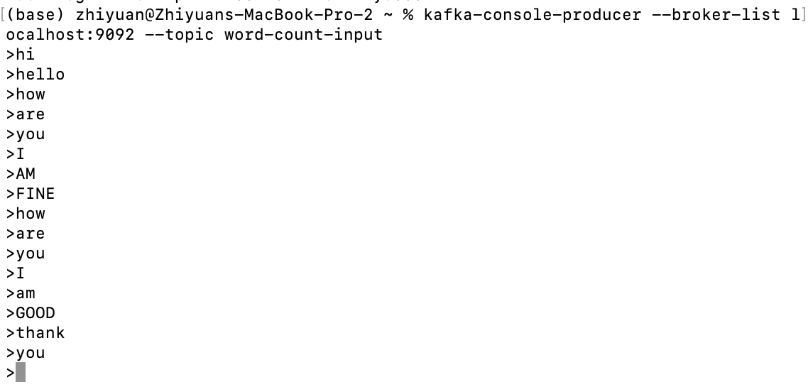
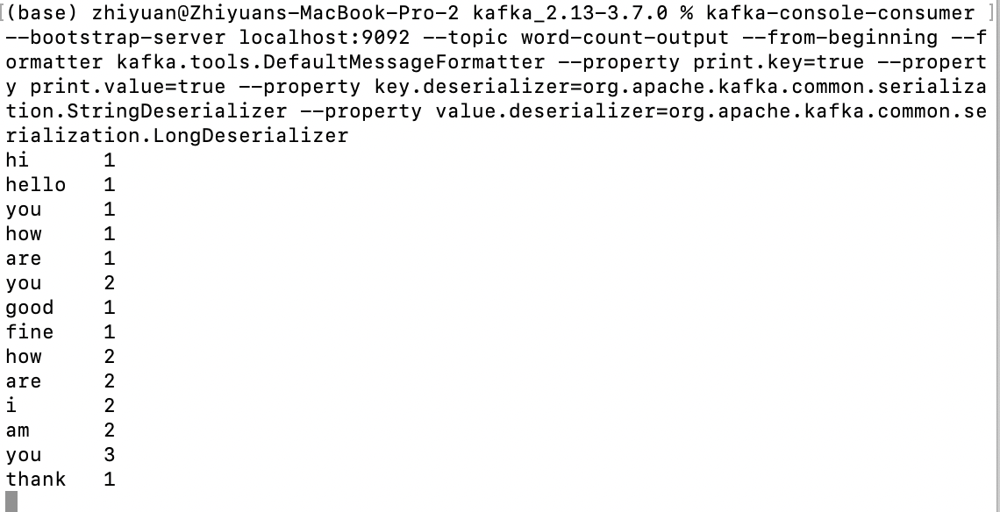
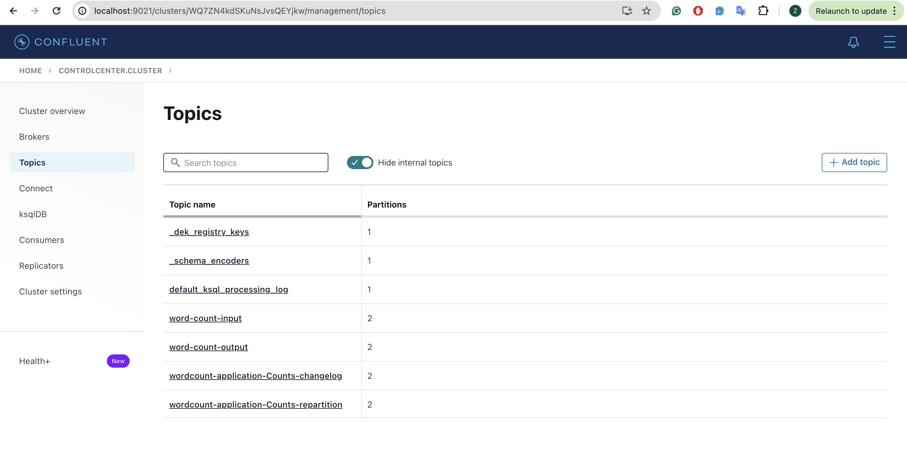
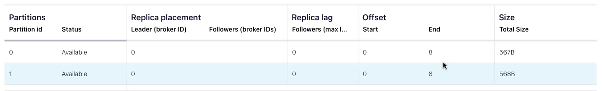

# kafka-streams-word-count
This is a **Kafka Streams application** that performs real-time word counting on incoming streams of text data. It ingests text data from a Kafka topic named `word-count-input`, processes each text line by converting it to lowercase, splitting it into individual words, and then counting the occurrences of each word. The application then outputs the word counts to another Kafka topic named `word-count-output`. 

## Steps
### 1. Run Confluent Platform locally
```
confluent local services start
```

### 2. Create input topic with 2 partitions
```
kafka-topics --create --zookeeper localhost:2181 --replication-factor 1 --partitions 2 --topic word-count-input
```

### 3. Create output topic
```
kafka-topics --create --zookeeper localhost:2181 --replication-factor 1 --partitions 2 --topic word-count-output
```

### 4. Launch a Kafka Consumer
```
kafka-console-consumer --bootstrap-server localhost:9092 --topic word-count-output --from-beginning --formatter kafka.tools.DefaultMessageFormatter --property print.key=true --property print.value=true --property key.deserializer=org.apache.kafka.common.serialization.StringDeserializer --property value.deserializer=org.apache.kafka.common.serialization.LongDeserializer
```

### 5. Launch the Streams Application

### 6. Launch a Kafka Producer
```
kafka-console-producer --broker-list localhost:9092 --topic word-count-input
```

### 7. Start producing data to it and see the output in the consumer console
a. Input data


b. Output data: word counts


### 8. Navigate to Confluent Control Center at http://localhost:9021 and see the topics

